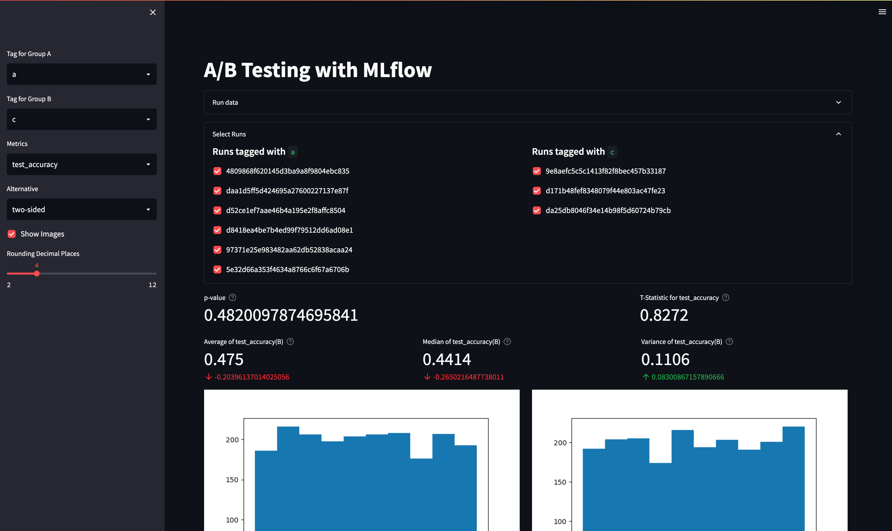

# MLflow Visualization App
Live demo: 

This app summarizes the results of a selection of MLflow runs from an experiment.

It calculates some helpful test statistics and can show plots which were saved as artifacts with the MLflow runs.
Consider this a template you can modify to create a "demo"-worthy presentation of progress in your ML Journey.

## Installation
A `requirements.txt` file is provided for a minimal example.
`streamlit` already carries most of the required libraries.
You can visit their [documentation here](https://docs.streamlit.io/library/api-reference).

Run `make install` to execute `pip install -r requirements.txt`.

## Usage

### Populate Data
Run `make fill` a couple of times to populate your MLflow database.

### Start App(s)
`make run` will start the streamlit app on port `8501` by default.

To see your MLflow runs, run `make serve` to start the server on port `5005`.

## Adoption

Feel free to adopt this to your own existing MLflow instance by modifying `app.py` to pick up your specific instance and experiment.
You will only need to add a tag to each run called `compare` for this app to pick up the runs as "suitable for analysis."

Runs with the `compare` tag will be picked up and shown in a collapsible window where you can include/exclude runs.
You can use any key you want for this tag, and the unique choices will be shown in the left panel under `A` and `B` representing the left and right set of samples you want to compare (adopted from the "A/B-testing" vernacular).

Any metrics that are found in the total collection of your selected runs will be available to analyze in the left panel, as is the selection of what kind of t-test you want to run (unequal variances assumed).
If metrics are missing for a particular group, you will see errors raised or `NaN` values displayed.

## License

MIT, use at your own discretion.
